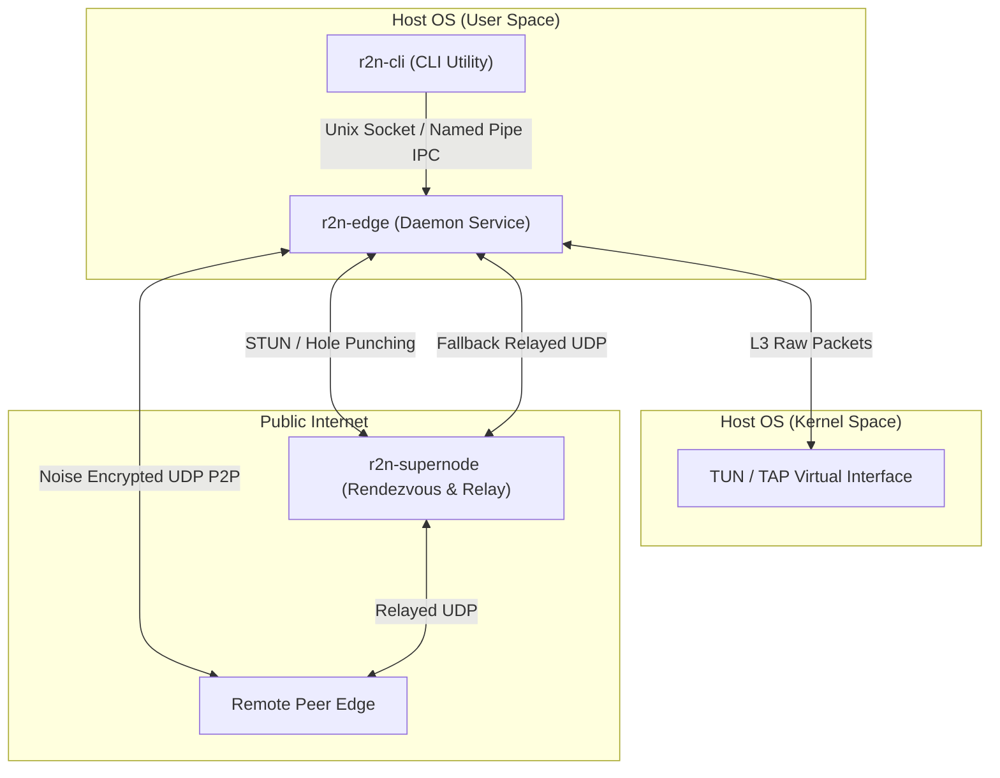

# R2N

<p align="center">
  
</p>

<p align="center">
  <strong>Modern, Low-Latency Encrypted Virtual LAN in Rust</strong>
</p>

<p align="center">
  Create secure, room-based virtual local area networks across the public Internet. R2N establishes direct UDP peer-to-peer paths, implements robust NAT traversal, forwards local discovery protocols, and falls back to supernode relaying only when necessary.
</p>

<p align="center">
  <a href="./README_CN.md">简体中文</a>
</p>

<p align="center">
  
  
  
  
</p>

---

## Table of Contents

- [Common Use Cases](#common-use-cases)
- [Core Technical Features](#core-technical-features)
- [Architecture](#architecture)
- [Repository Layout](#repository-layout)
- [Quick Start](#quick-start)
- [Configuration Reference](#configuration-reference)
- [Common Commands](#common-commands)
- [Security Model](#security-model)
- [Project Status](#project-status)
- [Development](#development)
- [License](#license)

---

## Common Use Cases

R2N is optimized for scenarios where standard point-to-point overlays are insufficient, specifically when applications rely on local network semantics and service discovery:

- **LAN Gaming \& Co-op (e.g., Minecraft, Retro Co-op)**: Securely bridge players across the public Internet into a single virtual network. By connecting directly to the host's virtual IP, players can host and join private multiplayer sessions with low-latency, UDP-first P2P connectivity. *(Note: While the codebase implements discovery packet classification, automatic LAN lobby discovery is currently under active optimization; players should connect via direct virtual IP in-game).*
- **Secure NAS \& Self-Hosted Management**: Access private NAS systems (Synology, TrueNAS), home media servers (Plex, Jellyfin), or smart home controllers (Home Assistant) securely. R2N interconnects your devices without requiring public port forwarding or exposing administration panels to the Internet.
- **Cross-Region Hybrid Networking**: Interconnect servers, IoT edge devices, and development workstations situated behind different firewalls into a single encrypted virtual network, preserving standard local LAN behavior.

---

## Core Technical Features

R2N is designed to address the security, performance, and maintenance limitations commonly found in legacy peer-to-peer virtual LAN architectures.

### 1. Data-Plane MTU Optimization (PMTUD & MSS Clamping)
Virtual network interfaces introduce routing overhead due to outer packet headers. To prevent silent packet drops and IP fragmentation bottlenecks, R2N embeds dynamic MTU management:
- **TCP MSS Clamping**: In the data-plane forwarding path, R2N inspects IPv4 TCP SYN segments. It dynamically rewrites the Maximum Segment Size (MSS) option to fit target TCP payloads within the network's `safe_payload_mtu` boundaries and transparently recomputes TCP checksums.
- **Path MTU Discovery (PMTUD) Simulation**: When a packet exceeding MTU size with the Don't Fragment (DF) bit set is captured, R2N generates an ICMP Destination Unreachable (Fragmentation Needed) packet back to the host, instructing the operating system's network stack to scale down its MTU dynamically.

### 2. Multi-Protocol NAT Traversal & Port Prediction
To establish direct peer-to-peer paths through symmetric NATs and stateful firewalls:
- **Concurrent STUN Probing**: R2N concurrently probes up to 15 public STUN servers using an asynchronous semaphore, evaluates round-trip times (RTT), and selects the top 5 lowest-latency candidates.
- **NAT Classification**: Dynamically infers mapping and filtering behaviors (Cone vs. Symmetric NAT).
- **Active Port Mapping**: Integrates UPnP IGD, NAT-PMP, and PCP protocols to actively request external mappings from local routers.
- **Symmetric NAT Port Prediction**: If a Symmetric NAT is detected, R2N analyzes port increment patterns (Deltas). It generates candidate target ports using the inferred delta, and constructs a sliding search window (`[-8, +8]` offset range) to perform UDP hole punching.

### 3. Layer 3/4 State Filter Engine (Firewall ACLs)
R2N contains an internal, zero-allocation packet filtering engine (`r2n-policy`) to secure virtual subnets:
- Rules can be defined based on traffic direction (`inbound`, `outbound`, `both`), protocols (`tcp`, `udp`, `icmp`, `any`), source/destination CIDR blocks, and source/destination port ranges.
- Highly optimized packet classification inspects IP and transport headers on-the-fly using the `etherparse` crate, dropping unauthorized packets before they enter the crypto tunnel.

### 4. Intelligent Discovery Classification & Storm Control
Blindly flooding broadcast/multicast packets over a virtual network causes significant overhead. R2N resolves this with:
- **Protocol Classification**: The `r2n-discovery` engine identifies mDNS (`224.0.0.251:5353`), SSDP (`239.255.255.250:1900`), NetBIOS UDP (`137/138`), standard `255.255.255.255` broadcasts, and subnet-level broadcasts (e.g. `/24` or `/16` broadcast addresses).
- **Token-Bucket Rate Limiting**: Employs a thread-safe token-bucket rate limiter (defaulting to 100 Packets-Per-Second) to intercept and suppress multicast/broadcast storms, protecting client host CPUs from flooding overhead.

### 5. Memory Safety & Privilege Separation
- **Memory Safety**: R2N is written entirely in Rust, guaranteeing compile-time memory safety and thread safety across the entire hot path of the packet forwarder.
- **Privilege Separation**: The background daemon (`r2n-edge`) runs with administrator privileges to manage virtual TUN/TAP adapters and system routing tables. The user control utility (`r2n-cli`) runs as a standard user, communicating with the daemon via local IPC Unix Domain Sockets (`/tmp/r2n_ipc_<user>.sock`) or Windows Named Pipes (`\\.\pipe\r2n_ipc`), ensuring maximum security boundaries.

---

## Architecture



### Components

- **`r2n-supernode`**: The control-plane rendezvous node. It coordinates room membership, assists with NAT hole punching by exchanging candidate addresses, and acts as a fallback relay if direct paths are blocked.
- **`r2n-edge`**: The background daemon. It runs the virtual LAN runtime, manages TUN/TAP devices, installs OS routes, performs Noise handshakes, and classifies discovery packets.
- **`r2n-cli`**: The user interface. It connects to the daemon via local IPC to execute room actions, retrieve metrics, and display diagnostic reports.

---

## Repository Layout

```text
apps/
  cli/               Binary crate for the CLI and daemon entrypoint
  supernode/         Binary crate for the supernode service

crates/
  r2n-cli/           CLI command handling and IPC client
  r2n-common/        Shared IDs, invite encoding (Postcard/Base64), and IPC paths
  r2n-config/        Unified edge/supernode configuration models
  r2n-crypto/        Handshake and dataplane crypto (Noise, ChaCha20-Poly1305)
  r2n-dataplane/     Packet forwarding, MSS clamping, PMTUD, and flood logic
  r2n-discovery/     LAN discovery classification and token-bucket limiter
  r2n-edge-lib/      Edge daemon runtime implementation
  r2n-nat/           NAT probing, STUN concurrency, UPnP/NAT-PMP/PCP mapping, and Symmetric NAT prediction
  r2n-observability/ Metrics and packet counters
  r2n-policy/        Layer 3/4 stateful traffic restriction rules (ACLs)
  r2n-proto/         Control and dataplane protocol types
  r2n-rendezvous/    Candidate pairing and hole-punching coordination
  r2n-room/          Room state and virtual subnet allocation
  r2n-route/         OS route installation helpers
  r2n-slab/          Packet slab for relay buffering
  r2n-supernode-lib/ Supernode runtime
  r2n-transport/     UDP transport framing and socket IO
  r2n-tun/           Cross-platform TUN/TAP backend (including embedded Wintun)
```

---

## Quick Start

R2N is in active pre-release development. Currently, it must be compiled from source.

### Prerequisites

- Rust stable (latest version recommended)
- A supported TUN/TAP environment (Note: R2N automatically bundles and deploys required driver binaries on supported platforms, such as automatically extracting and registering `wintun.dll` on Windows at startup)
- Administrative privileges (required to create virtual interfaces and manage route tables)

### 1. Build the Workspace
```bash
cargo build --release
```

### 2. Run a Supernode
Start the rendezvous node. By default, it listens on UDP port `7777`.
```bash
cargo run --release -p supernode
```

### 3. Start the Local Daemon
Start the edge daemon under administrative privileges (e.g., `sudo`). Specify the supernode's address and the name of the virtual interface to create.
```bash
sudo ./target/release/r2n-cli-bin daemon --supernode 203.0.113.10:7777 --tun r2n0
```

### 4. Create a Virtual Room
Open a new terminal window and create a room. The daemon will print the room metadata, virtual IP allocation, and a cryptographically signed invite code.
```bash
r2n-cli-bin room create --name "Office LAN"
```

### 5. Join the Room from a Peer
On another host running the R2N daemon, join using the generated invite code:
```bash
r2n-cli-bin room join --invite "<invite-code>"
```

### 6. Inspect the Runtime Status
Verify connection states, query peer latencies, and check diagnostics:
```bash
r2n-cli-bin status
r2n-cli-bin diagnose
r2n-cli-bin metrics
```

---

## Configuration Reference

R2N utilizes a structured TOML file to configure the edge daemon and supernodes.

### Edge Configuration (config.toml)

Save as `config.toml` in your working directory or set `R2N_CONFIG_PATH`:

```toml
[edge]
# Unique node identifier (optional, auto-generated if omitted)
# node_id = "0102030405060708090a0b0c0d0e0f101112131415161718191a1b1c1d1e1f20"

# Noise Protocol private key in hex (optional, auto-generated if omitted)
# private_key = "e0f102030405..."

# Supernode connection details
default_supernode = "203.0.113.10:7777"
supernodes = ["203.0.113.10:7777", "198.51.100.22:7777"]

# Network interface configuration
default_tun_name = "r2n0"
local_udp_port = 0           # Bind to random local port
tun_mtu = 1280               # Tunnel MTU (default: 1280)
ping_interval_secs = 10      # Latency ping frequency
watchdog_timeout_secs = 30   # Connection timeout threshold
log_level = "info"
nickname = "edge-node-1"

# Concurrently probed STUN servers for NAT diagnostics and hole punching
stun_servers = [
  "stun.miwifi.com:3478",
  "stun.qq.com:3478",
  "stun.l.google.com:19302"
]

# Discovery rules for broadcast/multicast traffic
[edge.discovery]
broadcast = true             # Enable limited broadcast (255.255.255.255)
subnet_broadcast = true      # Enable subnet broadcasts (e.g. /24 broadcast)
multicast = true             # Enable general IPv4 multicast (224.0.0.0/4)
mdns = true                  # Forward mDNS (224.0.0.251:5353)
ssdp = true                  # Forward SSDP (239.255.255.250:1900)
netbios = false              # Disable NetBIOS broadcasts (UDP 137, 138)
rate_limit_pps = 100         # Token-bucket rate limit (packets per second)

# Backend execution mode
[edge.backend]
mode = "tun"                 # Options: "tun" or "tap"
desktop_l2_enhanced = false  # Support layer 2 extensions on desktop if needed

# Virtual LAN routing priority
[edge.virtual_lan]
prefer_virtual_interface = true

# L3/L4 Traffic Firewall Policy (Access Control List)
[edge.traffic_policy]
enabled = true
default_action = "allow"     # Action when no rules match: "allow" or "deny"

# List of stateful traffic control rules (processed top-to-bottom)
[[edge.traffic_policy.rules]]
id = "block-untrusted-subnet"
enabled = true
action = "deny"
direction = "both"
src_cidr = "192.168.99.0/24"
protocol = "any"

[[edge.traffic_policy.rules]]
id = "allow-ssh-inbound"
enabled = true
action = "allow"
direction = "inbound"
protocol = "tcp"
dst_ports = [{ start = 22, end = 22 }]

[[edge.traffic_policy.rules]]
id = "block-unsafe-udp"
enabled = true
action = "deny"
direction = "outbound"
protocol = "udp"
dst_ports = [{ start = 1000, end = 2000 }]
```

### Supernode Configuration (supernode.toml)

```toml
[supernode]
listen_port = 7777
log_level = "info"
public_addr = "203.0.113.10:7777"      # Optional public interface advertisement
peers = []                             # Supernode federation peers
admin_token = "admin-secret-token"     # Authentication token for control tools
management_bind = "127.0.0.1:8888"     # Local admin HTTP/TCP port

# Virtual IP Address Pool Management
address_pool = "10.66.0.0/16"          # IP pool allocated to rooms
room_prefix_len = 24                   # Allocates a /24 subnet per virtual room
room_idle_timeout_secs = 600           # Auto-destroy idle rooms after 10 mins
max_room_peers = 254                   # Max nodes per room
```

---

## Common Commands

```bash
# Room Management
r2n-cli-bin room create --name "my-room"
r2n-cli-bin room join --invite "<invite-code>"
r2n-cli-bin room list
r2n-cli-bin room leave

# Diagnostics and Monitoring
r2n-cli-bin status
r2n-cli-bin diagnose
r2n-cli-bin metrics
r2n-cli-bin doctor

# Route & Network Inspection
r2n-cli-bin route show
r2n-cli-bin l2 table
```

---

## Security Model

R2N enforces cryptographic boundaries to ensure data privacy and room isolation:

- **End-to-End Encryption (E2EE)**: Edge-to-edge communication is encrypted via Noise session handshakes using ChaCha20-Poly1305 AEAD.
- **Untrusted Supernodes**: Supernodes handle connection routing and packet forwarding but lack the cryptographic keys necessary to decrypt end-to-peer data payloads.
- **Invite Authentication**: Rooms are protected against unauthorized entry by cryptographically signed invite tokens.

For detailed security guidelines, refer to [SECURITY.md](./SECURITY.md).

---

## Project Status

R2N is currently in its pre-release development phase:
- **Available now**: Full Rust networking workspace, Noise handshakes, UDP NAT hole punching, packet-level classification policies, and local IPC diagnostics.
- **Under development**: Native GUI interfaces, automated platform packaging (msi, deb, brew), and large-scale public mesh evaluation.

---

## Development

Use the following checks to ensure code quality:
```bash
cargo fmt --all -- --check
cargo check --all-targets --all-features
cargo test --all-targets --all-features
cargo clippy --all-targets --all-features -- -D warnings
```

---

## License

This project is licensed under the Apache License 2.0. See [LICENSE](./LICENSE) for the full text.
