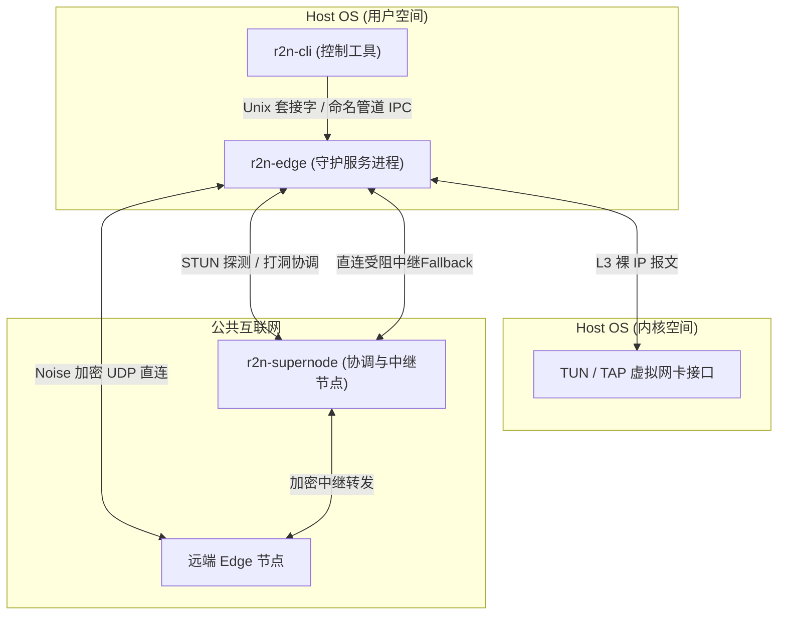

# R2N

<p align="center">
  
</p>

<p align="center">
  <strong>基于 Rust 的现代化、低延迟加密虚拟局域网</strong>
</p>

<p align="center">
  通过公网构建安全的房间制虚拟局域网。R2N 优先建立直连 UDP 点对点（P2P）路径，实现高效的 NAT 穿透，支持局域网服务发现流量转发，并在必要时提供超级节点（Supernode）加密中继兜底。
</p>

<p align="center">
  <a href="./README.md">English</a>
</p>

<p align="center">
  
  
  
  
</p>

---

## 目录

- [常见使用场景](#常见使用场景)
- [核心技术特性](#核心技术特性)
- [架构设计](#架构设计)
- [仓库目录结构](#仓库目录结构)
- [快速开始](#快速开始)
- [配置参数参考](#配置参数参考)
- [常用命令](#常用命令)
- [安全模型](#安全模型)
- [项目状态](#项目状态)
- [开发指南](#开发指南)
- [开源协议](#开源协议)

---

## 常见使用场景

R2N 特别针对传统点对点（P2P）打洞工具难以处理的局域网发现协议进行了深度优化，非常适合以下需要强局域网语义的应用场景：

- **局域网游戏联机（如 Minecraft、各类经典联机游戏）**：在公网将玩家安全互联至统一的虚拟局域网中。玩家可以通过直接连接主机的虚拟 IP 快速加入私有游戏房间，享受低延迟、UDP 优先的 P2P 直连体验。（注：尽管协议层已实现局域网发现报文分类器，但目前游戏内自动大厅发现功能仍在持续优化中，目前联机仍需手动输入房主的虚拟 IP）。
- **安全 NAS 管理与私有云部署**：远程安全访问私有 NAS 系统（如群晖 Synology、TrueNAS）、家庭媒体服务器（Plex、Jellyfin）或智能家居控制面板（Home Assistant）。使用 R2N 无需在公网路由器上配置端口映射（Port Forwarding），也无需将管理面板暴露在公网，有效防范黑客扫描。
- **异地多中心组网与混合云**：将部署在不同物理地点、处于不同 NAT 防火墙后端的服务器、边缘计算节点及开发工作站无缝连接进同一个虚拟内网中，保留局域网底层通信特性的同时实现全加密互联。

---

## 核心技术特性

R2N 从底层重新设计，旨在解决传统虚拟局域网软件在安全性、网络性能以及维护成本上面临的诸多痛点。

### 1. 数据面 MTU 优化（PMTUD 与 TCP MSS 动态夹紧）
虚拟网卡引入的额外包头开销往往会导致网络报文超出物理 MTU，从而引发静默丢包或 IP 分片问题。R2N 内置了完善的 MTU 管理机制：
- **TCP MSS 夹紧**：在数据面转发热路径上，R2N 会智能截获 IPv4 TCP SYN 握手报文，将其最大段大小（MSS）选项重写为契合隧道网络 `safe_payload_mtu` 的安全值，并实时重新计算 TCP 校验和。
- **PMTUD（路径 MTU 发现）模拟**：若截获的报文体积超过 MTU 限制且设置了“不可分片（DF）”标志位，R2N 会在本地向源主机反向发送 ICMP Destination Unreachable (Fragmentation Needed) 报文，引导主机的操作系统网络栈动态缩小发送窗口，从根本上杜绝隧道丢包。

### 2. 多协议 NAT 穿透与对称 NAT 端口预测
为了能够在复杂的多层 NAT 以及对称型（Symmetric）防火墙后端建立 P2P 直连通道：
- **并发 STUN 探测**：R2N 使用异步信号量并发探测多达 15 个公网 STUN 服务器，并根据响应时间（RTT）进行升序排序，优选前 5 个延迟最低的 STUN 服务器作为反射候选地址。
- **NAT 类型自动判别**：动态识别并评估本地环境属于锥形（Cone）还是对称（Symmetric）NAT 映射。
- **主动端口映射**：无缝整合了 UPnP IGD、NAT-PMP 和 PCP 协议，自动向本地路由器申请外部端口映射。
- **对称 NAT 端口预测**：在遭遇对称 NAT 限制时，R2N 会分析公网映射端口的递增规律（Deltas），依此计算后续候选端口，并构建以预测端口为核心的滑动搜索窗口（`[-8, +8]` 端口偏移范围）进行 UDP 穿透打洞。

### 3. Layer 3/4 状态过滤防火墙 (ACLs)
R2N 内部集成了一个轻量级、零内存分配的包过滤策略引擎 (`r2n-policy`)：
- 用户可以根据报文方向（`inbound`、`outbound`、`both`）、传输协议（`tcp`、`udp`、`icmp`、`any`）、源/目的 CIDR 子网以及端口范围定义精细的规则。
- 防火墙在解密与封装的前后，使用 `etherparse` 库零拷贝提取 IP 和传输层头部特征并进行规则匹配，有效在数据面阻断非法流量。

### 4. 局域网协议分类与发现报文风暴控制
盲目地向所有虚拟节点广播或组播数据包会极大耗费主机 CPU 资源，并导致虚拟网络拥堵。R2N 提供了智能的控制方案：
- **流量协议分类**：`r2n-discovery` 引擎能够精确识别 mDNS (`224.0.0.251:5353`)、SSDP (`239.255.255.250:1900`)、NetBIOS 广播 (`UDP 137/138`)、标准的 `255.255.255.255` 全网广播以及各类子网级别的定向广播报文。
- **令牌桶限流算法**：采用线程安全的令牌桶限流器（默认限制为 100 PPS），限制每秒转发的广播/组播帧数，防止发现协议在虚拟局域网中产生泛洪风暴。

### 5. 内存安全与特权边界隔离
- **内存安全**：核心网络转发与解密逻辑完全采用 Rust 编写，通过严苛的编译期所有权和生命周期校验，确保零内存破坏漏洞，高负载数据面线程安全无隐患。
- **特权边界隔离**：后台守护进程 (`r2n-edge`) 以管理员特权运行，专职管理 TUN/TAP 网卡与配置路由表。用户操作工具 (`r2n-cli`) 则在用户态运行，两者间通过本地 IPC Unix 域套接字（`/tmp/r2n_ipc_<user>.sock`）或 Windows 命名管道（`\\.\pipe\r2n_ipc`）进行高安全性的沙箱通信，将高权限代码的暴露面缩减到最小。

---

## 架构设计



### 核心组件说明

- **`r2n-supernode`**：控制面 rendezvous 协调器。用于管理房间生命周期、交换 NAT 打洞候选者地址，并在直连通道受阻时提供中继转发。
- **`r2n-edge`**：后台守护进程。负责维持虚拟局域网运行时、TUN/TAP 网卡管理、路由注入、Noise 安全协商握手和局域网广播包的流量分类。
- **`r2n-cli`**：命令行客户端。通过本地 IPC 接口与 daemon 进行交互，以执行房间管理、链路检测、状态与指标显示。

---

## 仓库目录结构

```text
apps/
  cli/               命令行与守护进程统一入口二进制 crate
  supernode/         超级节点服务二进制 crate

crates/
  r2n-cli/           CLI 命令行解析与 IPC 客户端
  r2n-common/        通用 ID 结构、邀请码编解码 (Postcard/Base64) 与 IPC 路径定义
  r2n-config/        统一的配置定义与 TOML 解析模型
  r2n-crypto/        握手协商与数据面加密助手 (Noise, ChaCha20-Poly1305)
  r2n-dataplane/     数据包收发控制、TCP MSS 夹紧、PMTUD 及风暴控制
  r2n-discovery/     局域网服务发现流量过滤分类与令牌桶限流器
  r2n-edge-lib/      Edge 守护进程运行时实现
  r2n-nat/           NAT 状态检测、多 STUN 并发优选、UPnP/NAT-PMP/PCP 映射与对称 NAT 端口预测
  r2n-observability/ 计数器与网络性能统计
  r2n-policy/        Layer 3/4 过滤规则与 ACL 防火墙策略引擎
  r2n-proto/         控制面与数据面报文格式定义
  r2n-rendezvous/    中继节点打洞配对状态机
  r2n-room/          虚拟子网划分与房间地址分配
  r2n-route/         系统路由配置注入逻辑
  r2n-slab/          高性能环形数据包中继缓冲区
  r2n-supernode-lib/ 超级节点核心运行时
  r2n-transport/     异步 UDP 收发组件与封包解析
  r2n-tun/           跨平台 TUN/TAP 网卡后端驱动（含 Windows 启动释放 wintun.dll 支持）
```

---

## 快速开始

R2N 目前处于预发布开发阶段，需要从源码进行本地编译。

### 前置条件

- 稳定的 Rust 工具链（推荐最新稳定版）
- 操作系统支持 TUN/TAP 虚拟网卡（注：R2N 会在支持的平台上自动处理所需驱动，例如在 Windows 启动时自动释放并注册 `wintun.dll`，无需手动预先安装配置）
- 管理员权限（用于创建虚拟网卡和修改系统路由表）

### 1. 编译工作区
```bash
cargo build --release
```

### 2. 运行超级节点
启动协调节点，默认监听 UDP 端口 `7777`。
```bash
cargo run --release -p supernode
```

### 3. 启动本地守护进程
以管理员权限（如使用 `sudo`）启动守护进程，配置超级节点地址并指定网卡名称。
```bash
sudo ./target/release/r2n-cli-bin daemon --supernode 203.0.113.10:7777 --tun r2n0
```

### 4. 创建虚拟房间
新开终端窗口，创建虚拟网段房间，守护进程将输出房间基本信息、分配的内网虚拟 IP 以及一段经由加密签名的 Base64 邀请码。
```bash
r2n-cli-bin room create --name "Office LAN"
```

### 5. 在远端节点加入房间
在另一台运行了 R2N 守护进程的主机上，使用刚刚生成的邀请码加入：
```bash
r2n-cli-bin room join --invite "<invite-code>"
```

### 6. 查看连接运行状态
验证连接建立情况、分析延迟指标和诊断结果：
```bash
r2n-cli-bin status
r2n-cli-bin diagnose
r2n-cli-bin metrics
```

---

## 配置参数参考

R2N 的边缘节点与超级节点均支持基于 TOML 文件进行细粒度配置。

### 边缘节点配置 (config.toml)

请将配置文件保存为 `config.toml`，或者使用环境变量 `R2N_CONFIG_PATH` 指向该文件：

```toml
[edge]
# 唯一的节点 ID 标识（可选，留空将自动生成）
# node_id = "0102030405060708090a0b0c0d0e0f101112131415161718191a1b1c1d1e1f20"

# 十六进制编码的 Noise 协议私钥（可选，留空将自动随机生成）
# private_key = "e0f102030405..."

# 超级协调中继节点地址
default_supernode = "203.0.113.10:7777"
supernodes = ["203.0.113.10:7777", "198.51.100.22:7777"]

# 本地网络与网卡配置
default_tun_name = "r2n0"
local_udp_port = 0           # 绑定本地随机 UDP 端口
tun_mtu = 1280               # 虚拟网卡 MTU（默认 1280）
ping_interval_secs = 10      # 连接保活与延迟测量周期
watchdog_timeout_secs = 30   # 连接超时断开判定阈值
log_level = "info"
nickname = "edge-node-1"

# 用于 NAT 穿透诊断和映射发现的公网 STUN 服务器列表
stun_servers = [
  "stun.miwifi.com:3478",
  "stun.qq.com:3478",
  "stun.l.google.com:19302"
]

# 局域网服务发现与广播/组播过滤配置
[edge.discovery]
broadcast = true             # 允许转发全网有限广播 (255.255.255.255)
subnet_broadcast = true      # 允许转发子网定向广播 (如 /24 广播网)
multicast = true             # 允许转发通用 IPv4 组播 (224.0.0.0/4)
mdns = true                  # 允许转发 mDNS 本地服务发现 (224.0.0.251:5353)
ssdp = true                  # 允许转发 SSDP 发现流量 (239.255.255.250:1900)
netbios = false              # 禁用 NetBIOS 广播 (UDP 137, 138)
rate_limit_pps = 100         # 发现流量令牌桶每秒限额 (PPS)

# 网卡执行后端模式
[edge.backend]
mode = "tun"                 # 可选参数："tun" 或 "tap"
desktop_l2_enhanced = false  # 是否在桌面平台启用 Layer 2 以太网扩展

# 路由控制选项
[edge.virtual_lan]
prefer_virtual_interface = true

# ACL 流量访问控制策略防火墙
[edge.traffic_policy]
enabled = true
default_action = "allow"     # 默认规则动作（未匹配时）："allow" 或 "deny"

# 精细化安全防火墙规则列表（从上到下顺序匹配）
[[edge.traffic_policy.rules]]
id = "block-untrusted-subnet"
enabled = true
action = "deny"
direction = "both"
src_cidr = "192.168.99.0/24"
protocol = "any"

[[edge.traffic_policy.rules]]
id = "allow-ssh-inbound"
enabled = true
action = "allow"
direction = "inbound"
protocol = "tcp"
dst_ports = [{ start = 22, end = 22 }]

[[edge.traffic_policy.rules]]
id = "block-unsafe-udp"
enabled = true
action = "deny"
direction = "outbound"
protocol = "udp"
dst_ports = [{ start = 1000, end = 2000 }]
```

### 超级节点配置 (supernode.toml)

```toml
[supernode]
listen_port = 7777
log_level = "info"
public_addr = "203.0.113.10:7777"      # 超级节点的公网通告 IP 端口
peers = []                             # 超级节点联邦成员地址列表
admin_token = "admin-secret-token"     # 用于管理工具鉴权的密匙
management_bind = "127.0.0.1:8888"     # 本地管理 HTTP/TCP API 监听接口

# 虚拟子网 IP 地址池划分与控制
address_pool = "10.66.0.0/16"          # 给各个房间分配的 IP 池
room_prefix_len = 24                   # 每个虚拟局域网房间分配一个 /24 掩码网段
room_idle_timeout_secs = 600           # 空闲房间自动回收销毁周期 (10分钟)
max_room_peers = 254                   # 房间内最大成员数
```

---

## 常用命令

```bash
# 房间会话管理
r2n-cli-bin room create --name "my-room"
r2n-cli-bin room join --invite "<invite-code>"
r2n-cli-bin room list
r2n-cli-bin room leave

# 链路诊断与性能分析
r2n-cli-bin status
r2n-cli-bin diagnose
r2n-cli-bin metrics
r2n-cli-bin doctor

# 路由与虚拟网表查询
r2n-cli-bin route show
r2n-cli-bin l2 table
```

---

## 安全模型

R2N 建立了明确的密码学信任边界，从而保护数据隐私与房间完全隔离：

- **端到端加密 (E2EE)**：成员节点（Edge）之间的数据面通信使用 Noise 协议握手生成对称会话密钥，并通过 ChaCha20-Poly1305 AEAD 保护所有承载流量。
- **零知识超级节点**：超级节点（Supernode）作为控制面用于交换连接地址以及在直连受阻时转发 UDP 密文。超级节点不参与密钥协商，对穿透数据链路的具体明文 payload 完全无感知，不构成中心化后门。
- **邀请码签名验证**：为了杜绝通过暴力破解或猜测房间名非法潜入内网，R2N 的邀请数据体均附带基于 Ed25519 密码学签名的检验串，仅当签名合法时才允许验证加入。

更详尽的安全边界设计，请阅读 [SECURITY.md](./SECURITY.md)。

---

## 项目状态

R2N 目前处于预发布开发阶段：
- **现已提供**：纯 Rust 编写的控制和数据面工作区、Noise 安全通道握手协商、UDP NAT 自动穿透与洞口打通、精准的流量协议过滤过滤、以及基于 IPC 管道的诊断查询功能。
- **正在开发**：跨平台原生 GUI 界面、自动包管理配置（msi, deb, brew 等安装包形式）、以及大规模公共网格性能评估。

---

## 开发指南

在提交任何修改前，请确保通过以下 Rust 工作区规范校验：
```bash
cargo fmt --all -- --check
cargo check --all-targets --all-features
cargo test --all-targets --all-features
cargo clippy --all-targets --all-features -- -D warnings
```

---

## 开源协议

本项目基于 Apache License 2.0 协议发布。完整许可文件内容请参见 [LICENSE](./LICENSE)。
